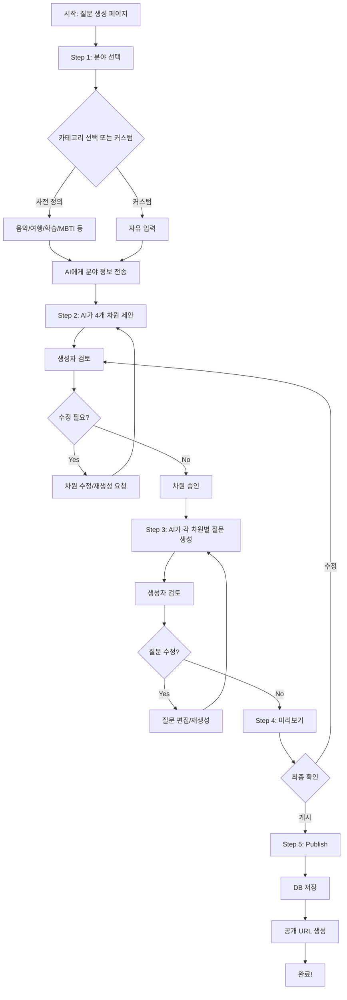

# 🎨 AI 기반 대화형 질문 생성 페이지 개발 프롬프트

---

## 📋 **목차**

1. [기능 개요](#1-기능-개요)
2. [사용자 플로우](#2-사용자-플로우)
3. [시스템 아키텍처](#3-시스템-아키텍처)
4. [백엔드 개발 프롬프트](#4-백엔드-개발-프롬프트)
5. [프론트엔드 개발 프롬프트](#5-프론트엔드-개발-프롬프트)
6. [AI 프롬프트 엔지니어링](#6-ai-프롬프트-엔지니어링)
7. [데이터베이스 설계](#7-데이터베이스-설계)
8. [통합 워크플로우](#8-통합-워크플로우)

---

## **1. 기능 개요**

### **1.1 서비스 컨셉**

```markdown
# 질문 생성 스튜디오 (Question Generator Studio)

## 핵심 기능
사용자(크리에이터)가 AI와 대화하며 새로운 주제의 질문 세트를 생성하고 게시할 수 있는 CMS

## 주요 기능
1. **분야 선택**: 사전 정의된 카테고리 또는 커스텀 입력
2. **AI 차원 제안**: 선택한 분야에 맞는 4개 차원 자동 생성
3. **차원 편집**: 생성자가 AI 제안을 수정/승인
4. **AI 질문 생성**: 각 차원별 A/B 질문 자동 생성
5. **질문 큐레이션**: 생성자가 질문 선택/수정
6. **미리보기**: 실제 사용자 경험 시뮬레이션
7. **게시**: 데이터베이스에 저장 및 공개

## 사용자 유형
- **크리에이터**: 질문 세트를 만드는 사람
- **AI 어시스턴트**: 제안 및 생성 지원
- **최종 사용자**: 게시된 질문에 답변하는 사람 (별도 페이지)
```

---

## **2. 사용자 플로우**

### **2.1 전체 플로우 다이어그램**



### **2.2 단계별 상세 플로우**

```markdown
## Step 1: 분야 선택
**화면 구성:**
- 제목: "어떤 주제로 질문을 만들까요?"
- 옵션 1: 카테고리 버튼 (음악 취향, 여행 스타일, 학습 유형 등)
- 옵션 2: 커스텀 입력 필드 + "시작하기" 버튼

**사용자 액션:**
- 카테고리 선택 또는 자유 텍스트 입력
- 예: "게임 플레이 스타일", "커피 취향", "독서 습관"

---

## Step 2: 차원 제안 받기
**화면 구성:**
- 채팅 인터페이스 스타일
- AI 메시지: "이 주제에 가장 적합한 4가지 차원을 제안해드릴게요!"
- 로딩 애니메이션
- 결과: 4개 차원 카드 표시

**차원 카드 구조:**
```
┌─────────────────────────────────────┐
│ 차원 1: 게임 장르 선호              │
├─────────────────────────────────────┤
│ Axis A: 액션/FPS (Action)           │
│ - 빠른 반응속도 중시                │
│ - 아드레날린 넘치는 플레이           │
│                                     │
│ Axis B: 전략/RPG (Strategy)         │
│ - 계획적 사고 중시                  │
│ - 깊이 있는 스토리                  │
├─────────────────────────────────────┤
│ [수정] [삭제] [재생성]              │
└─────────────────────────────────────┘
```

**사용자 액션:**
- 각 차원 승인
- 텍스트 수정
- "이 차원 삭제하고 다른 거 제안해줘" 버튼
- 모든 차원 승인 후 "다음 단계로" 버튼

---

## Step 3: 질문 생성
**화면 구성:**
- 진행 표시: "차원 1/4 질문 생성 중..."
- AI 메시지: "각 차원별로 최적의 질문을 생성하고 있어요"
- 생성 완료 시 질문 카드 표시

**질문 카드 구조:**
```
┌─────────────────────────────────────────────┐
│ 질문 1: 게임 장르 선호                       │
├─────────────────────────────────────────────┤
│ 질문 텍스트:                                 │
│ "게임을 선택할 때 더 끌리는 것은?"          │
│                                             │
│ 선택지 A: 액션/FPS                           │
│ • 빠른 반응속도가 중요한 게임               │
│ • 실시간 전투와 긴장감                      │
│ • 예: 오버워치, 배틀그라운드                │
│                                             │
│ 선택지 B: 전략/RPG                           │
│ • 신중한 계획과 전략이 중요                 │
│ • 캐릭터 성장과 스토리                      │
│ • 예: 문명, 발더스 게이트                   │
├─────────────────────────────────────────────┤
│ [편집] [다른 질문 생성] [이 질문 사용]      │
└─────────────────────────────────────────────┘
```

**사용자 액션:**
- 질문 텍스트 직접 수정
- "다른 질문 생성해줘" (같은 차원, 다른 표현)
- "이 질문 사용" 체크
- 4개 질문 모두 선택 후 "미리보기" 버튼

---

## Step 4: 미리보기
**화면 구성:**
- 실제 사용자가 보는 화면 시뮬레이션
- 질문 1 → 2 → 3 → 4 순서로 표시
- 임시 답변 입력 가능
- "수정하기" / "게시하기" 버튼

---

## Step 5: 게시
**화면 구성:**
- 추가 정보 입력 폼
  - 주제 이름: "나의 게임 스타일은?"
  - 설명: "당신의 게임 플레이 성향을 분석합니다"
  - 썸네일 이미지 업로드 (선택)
  - 공개 범위: [전체 공개 / 링크만 / 비공개]
- "게시하기" 버튼
- 성공 시 공유 URL 표시
```

---

## **3. 시스템 아키텍처**

### **3.1 아키텍처 설계 프롬프트**

```markdown
# AI 개발 도우미에게 줄 프롬프트

당신은 시스템 아키텍트입니다. 다음 질문 생성 시스템의 아키텍처를 설계해주세요:

## 요구사항
### 기능적 요구사항
1. 사용자가 분야를 입력하면 AI가 4개 차원 제안
2. 각 차원별로 AI가 A/B 질문 생성 (선택지 3개씩)
3. 사용자가 질문 선택/수정
4. 임시 저장 (Draft) 기능
5. 최종 게시 (Publish)
6. 게시된 질문의 고유 URL 생성

### 비기능적 요구사항
- AI 응답 시간: 5초 이내
- 동시 생성 세션: 50개 이상
- 임시 저장 유효기간: 7일
- 실시간 협업 (선택, WebSocket)

## 기술 스택
**프론트엔드:**
- Next.js 14 (App Router)
- React 18 + TypeScript
- TailwindCSS + shadcn/ui
- Zustand (상태 관리)
- React Query (API 캐싱)

**백엔드:**
- FastAPI (Python)
- OpenAI GPT-4 API (질문 생성)
- Redis (세션 임시 저장)
- PostgreSQL (게시된 데이터)

**배포:**
- Vercel (프론트엔드)
- Railway (백엔드)

## 출력 요청
1. 시스템 컴포넌트 다이어그램
2. API 엔드포인트 목록
3. 데이터 흐름도
4. 상태 관리 전략
5. 에러 처리 전략
```

---

## **4. 백엔드 개발 프롬프트**

### **4.1 FastAPI 프로젝트 구조**

```markdown
# 프롬프트: 질문 생성 백엔드 구조

당신은 Python 백엔드 전문가입니다. 질문 생성 시스템의 FastAPI 백엔드를 구성해주세요:

## 프로젝트 구조
```
backend/
├── app/
│   ├── main.py
│   ├── config.py
│   ├── models/
│   │   ├── theme.py          # 주제 모델
│   │   ├── dimension.py      # 차원 모델
│   │   ├── question.py       # 질문 모델
│   │   └── draft.py          # 임시 저장 모델
│   ├── schemas/
│   │   ├── generation.py     # AI 생성 요청/응답
│   │   └── publication.py    # 게시 스키마
│   ├── services/
│   │   ├── openai_service.py # OpenAI API 통합
│   │   ├── dimension_generator.py  # 차원 생성 로직
│   │   ├── question_generator.py   # 질문 생성 로직
│   │   └── mds_calculator.py       # 좌표 계산
│   ├── api/
│   │   ├── v1/
│   │   │   ├── generation.py      # 생성 API
│   │   │   ├── drafts.py          # 임시 저장 API
│   │   │   └── themes.py          # 게시 API
│   └── prompts/
│       ├── dimension_prompts.py   # AI 프롬프트 템플릿
│       └── question_prompts.py
├── tests/
└── requirements.txt
```

## 핵심 서비스 구현 요청

### 1. OpenAI 서비스 (openai_service.py)
```python
class OpenAIService:
    def __init__(self, api_key: str):
        self.client = OpenAI(api_key=api_key)
    
    async def generate_dimensions(
        self, 
        field: str, 
        context: Optional[str] = None
    ) -> List[Dimension]:
        """분야에 맞는 4개 차원 생성"""
        pass
    
    async def generate_questions(
        self, 
        dimension: Dimension,
        num_variations: int = 3
    ) -> List[Question]:
        """차원에 맞는 질문 변형 생성"""
        pass
```

### 2. 차원 생성기 (dimension_generator.py)
- GPT-4에게 전달할 프롬프트 구성
- 응답 파싱 및 검증
- 4개 차원 보장 (부족하면 재시도)

### 3. 질문 생성기 (question_generator.py)
- 각 차원별 3개 질문 변형 생성
- A/B 선택지 균형 확인
- 예시 포함 여부 제어

## API 엔드포인트 구현

### POST /api/v1/generation/dimensions
**요청:**
```json
{
  "field": "게임 플레이 스타일",
  "context": "액션, RPG, 전략 등 다양한 장르 포함",
  "session_id": "optional-uuid"
}
```

**응답:**
```json
{
  "session_id": "abc-123",
  "dimensions": [
    {
      "id": "dim-1",
      "order": 1,
      "name": "게임 장르 선호",
      "axis_a": {
        "label": "Action",
        "description": "빠른 반응속도 중시",
        "examples": ["오버워치", "배틀그라운드"]
      },
      "axis_b": {
        "label": "Strategy",
        "description": "계획적 사고 중시",
        "examples": ["문명", "스타크래프트"]
      }
    }
    // ... 3개 더
  ]
}
```

### POST /api/v1/generation/questions
**요청:**
```json
{
  "session_id": "abc-123",
  "dimension_id": "dim-1",
  "num_variations": 3
}
```

**응답:**
```json
{
  "questions": [
    {
      "id": "q-1",
      "text": "게임을 선택할 때 더 끌리는 것은?",
      "option_a": {
        "label": "액션/FPS",
        "description": "빠른 반응속도가 중요한 게임",
        "examples": ["오버워치", "배틀그라운드"]
      },
      "option_b": {
        "label": "전략/RPG",
        "description": "신중한 계획과 전략이 중요",
        "examples": ["문명", "발더스 게이트"]
      }
    }
    // ... 2개 변형 더
  ]
}
```

### POST /api/v1/drafts/save
**요청:**
```json
{
  "session_id": "abc-123",
  "theme_name": "나의 게임 스타일",
  "dimensions": [...],
  "questions": [...]
}
```

**응답:**
```json
{
  "draft_id": "draft-xyz",
  "expires_at": "2026-02-27T00:00:00Z"
}
```

### POST /api/v1/themes/publish
**요청:**
```json
{
  "draft_id": "draft-xyz",
  "theme_name": "나의 게임 스타일은?",
  "description": "당신의 게임 플레이 성향을 분석합니다",
  "thumbnail_url": "https://...",
  "visibility": "public"
}
```

**응답:**
```json
{
  "theme_id": "theme-123",
  "slug": "my-game-style",
  "public_url": "https://coordinateme.app/theme/my-game-style",
  "published_at": "2026-02-20T13:00:00Z"
}
```

완전한 구현 코드를 생성해주세요 (타입 힌트, docstring, 에러 처리 포함).
```

### **4.2 AI 프롬프트 템플릿 구현**

```python
# 프롬프트: OpenAI 프롬프트 템플릿 작성

"""
다음 Python 모듈을 구현해주세요:

파일: app/prompts/dimension_prompts.py

## 요구사항
1. 분야(field)를 입력받아 4개의 독립적인 차원 생성
2. 각 차원은 명확한 양극성(A ↔ B)을 가져야 함
3. 차원 간 상관관계 최소화
4. 측정 가능한 특성
5. JSON 형식으로 출력

## 프롬프트 템플릿 구조
```python
DIMENSION_GENERATION_PROMPT = '''
당신은 성격/취향 분석 전문가입니다.

## 목표
사용자가 제공한 분야에 대해 4개의 독립적인 차원(dimension)을 생성하세요.
각 차원은 유클리드 거리 기반 좌표 계산에 사용될 것입니다.

## 입력
- 분야: {field}
- 추가 컨텍스트: {context}

## 차원 설계 원칙
1. **독립성**: 각 차원은 서로 다른 측면을 측정해야 합니다
2. **양극성**: 명확한 A ↔ B 대립 구조
3. **측정 가능성**: 질문으로 측정할 수 있는 특성
4. **균형성**: A와 B 모두 긍정적 의미 (한쪽이 부정적이면 안 됨)
5. **포괄성**: 4개 차원으로 해당 분야를 충분히 설명

## 출력 형식 (JSON)
{{
  "dimensions": [
    {{
      "order": 1,
      "name": "차원 이름",
      "description": "이 차원이 측정하는 것",
      "axis_a": {{
        "label": "축 A 레이블 (영문 1단어)",
        "korean_label": "축 A 한글 레이블",
        "description": "축 A의 특징 (20자 이내)",
        "traits": ["특징1", "특징2", "특징3"],
        "examples": ["예시1", "예시2"]
      }},
      "axis_b": {{
        "label": "축 B 레이블 (영문 1단어)",
        "korean_label": "축 B 한글 레이블",
        "description": "축 B의 특징 (20자 이내)",
        "traits": ["특징1", "특징2", "특징3"],
        "examples": ["예시1", "예시2"]
      }}
    }}
    // ... 3개 더 (총 4개)
  ]
}}

## 예시 (분야: 음악 취향)
{{
  "dimensions": [
    {{
      "order": 1,
      "name": "음악 구조 선호",
      "description": "리듬과 멜로디 중 어느 것에 더 끌리는지",
      "axis_a": {{
        "label": "Rhythmic",
        "korean_label": "리듬 중심",
        "description": "비트와 그루브를 중시",
        "traits": ["강한 드럼", "반복적 패턴", "몸이 움직이는"],
        "examples": ["EDM", "Hip-hop", "Funk"]
      }},
      "axis_b": {{
        "label": "Melodic",
        "korean_label": "멜로디 중심",
        "description": "선율과 화음을 중시",
        "traits": ["아름다운 코드", "귀에 맴도는", "감정적 울림"],
        "examples": ["Jazz", "Classical", "R&B"]
      }}
    }}
  ]
}}

이제 다음 분야에 대해 4개 차원을 생성하세요:
분야: {field}
컨텍스트: {context}
'''

def get_dimension_prompt(field: str, context: str = "") -> str:
    return DIMENSION_GENERATION_PROMPT.format(
        field=field,
        context=context or "없음"
    )
```

## 질문 생성 프롬프트도 작성해주세요
파일: app/prompts/question_prompts.py

목표: 차원 정보를 받아서 A/B 질문 생성 (3개 변형)

완전한 코드를 생성해주세요.
"""
```

---

## **5. 프론트엔드 개발 프롬프트**

### **5.1 Next.js 페이지 구조**

```markdown
# 프롬프트: 질문 생성 페이지 구조

React 18 + Next.js 14로 질문 생성 페이지를 구현해주세요:

## 프로젝트 구조
```
frontend/src/
├── app/
│   └── studio/
│       └── create/
│           └── page.tsx          # 메인 생성 페이지
├── components/
│   ├── studio/
│   │   ├── StepIndicator.tsx    # 진행 단계 표시
│   │   ├── FieldSelector.tsx    # Step 1: 분야 선택
│   │   ├── DimensionReview.tsx  # Step 2: 차원 검토
│   │   ├── QuestionCurator.tsx  # Step 3: 질문 큐레이션
│   │   ├── PreviewMode.tsx      # Step 4: 미리보기
│   │   └── PublishForm.tsx      # Step 5: 게시
│   └── ui/
│       ├── ChatMessage.tsx      # AI 메시지 컴포넌트
│       ├── DimensionCard.tsx    # 차원 카드
│       └── QuestionCard.tsx     # 질문 카드
├── hooks/
│   ├── useGenerationSession.ts  # 세션 상태 관리
│   └── useAIGenerator.ts        # AI 생성 호출
├── lib/
│   └── api/
│       └── generation.ts        # API 클라이언트
└── types/
    └── generation.ts            # 타입 정의
```

## 핵심 컴포넌트 구현 요청

### 1. 메인 페이지 (page.tsx)
```typescript
// app/studio/create/page.tsx

/*
다음 사양에 맞는 메인 페이지를 구현해주세요:

## 기능
- 5단계 스텝 진행 (Step Indicator)
- 각 단계별 컴포넌트 조건부 렌더링
- 전역 상태 관리 (Zustand)
- API 호출 및 로딩 상태
- 에러 처리 및 토스트 알림

## 상태 관리
```typescript
interface GenerationState {
  currentStep: 1 | 2 | 3 | 4 | 5;
  sessionId: string | null;
  field: string;
  dimensions: Dimension[];
  questions: Map<string, Question[]>; // dimension_id -> questions
  selectedQuestions: Question[];
  isLoading: boolean;
  error: string | null;
  
  // Actions
  setField: (field: string) => void;
  setDimensions: (dimensions: Dimension[]) => void;
  addQuestions: (dimensionId: string, questions: Question[]) => void;
  selectQuestion: (question: Question) => void;
  nextStep: () => void;
  prevStep: () => void;
}
```

## 레이아웃
- 좌측: 진행 단계 표시 (스티키)
- 우측: 현재 단계 컴포넌트
- 하단: 이전/다음 버튼

완전한 Next.js 페이지 코드를 생성해주세요 (TypeScript, TailwindCSS).
*/
```

### 2. 분야 선택 컴포넌트 (FieldSelector.tsx)
```typescript
// 프롬프트: 분야 선택 컴포넌트

/*
다음 사양에 맞는 FieldSelector 컴포넌트를 구현해주세요:

## UI 구성
1. 제목: "어떤 주제로 질문을 만들까요?"
2. 카테고리 그리드 (2x3)
   - 음악 취향
   - 여행 스타일
   - 학습 유형
   - 게임 플레이
   - 식사 선호
   - 커스텀 입력
3. 커스텀 선택 시: 텍스트 입력 + "시작하기" 버튼

## Props
```typescript
interface FieldSelectorProps {
  onSelect: (field: string) => Promise<void>;
  isLoading: boolean;
}
```

## 기능
- 카테고리 버튼 클릭 시 즉시 API 호출
- 커스텀 입력 시 validation (최소 2글자)
- 로딩 중 버튼 비활성화
- 애니메이션 (버튼 호버, 선택 효과)

## 스타일
- 카드 기반 레이아웃
- 아이콘 포함 (lucide-react)
- 호버 시 확대 효과
- 선택 시 체크마크 표시

shadcn/ui 컴포넌트 사용, 완전한 코드 생성해주세요.
*/
```

### 3. 차원 검토 컴포넌트 (DimensionReview.tsx)
```typescript
// 프롬프트: 차원 검토 컴포넌트

/*
다음 사양에 맞는 DimensionReview 컴포넌트를 구현해주세요:

## UI 구성
1. AI 메시지: "4가지 차원을 제안해드렸어요!"
2. 4개 차원 카드 (세로 스택)
3. 각 카드에 편집/삭제/재생성 버튼
4. 하단: "모두 승인하고 다음으로" 버튼

## Props
```typescript
interface DimensionReviewProps {
  dimensions: Dimension[];
  onEdit: (dimensionId: string, updates: Partial<Dimension>) => void;
  onRegenerate: (dimensionId: string) => Promise<void>;
  onDelete: (dimensionId: string) => void;
  onApprove: () => void;
}
```

## 차원 카드 구조
```typescript
<Card>
  <CardHeader>
    <Badge>차원 {order}</Badge>
    <CardTitle>{name}</CardTitle>
  </CardHeader>
  <CardContent>
    <div className="grid grid-cols-2 gap-4">
      {/* Axis A */}
      <div>
        <h4>Option A: {axis_a.label}</h4>
        <p>{axis_a.description}</p>
        <ul>{axis_a.traits.map(...)}</ul>
        <div>예: {axis_a.examples.join(', ')}</div>
      </div>
      {/* Axis B */}
      <div>...</div>
    </div>
  </CardContent>
  <CardFooter>
    <Button variant="ghost" onClick={onEdit}>편집</Button>
    <Button variant="ghost" onClick={onRegenerate}>재생성</Button>
    <Button variant="destructive" onClick={onDelete}>삭제</Button>
  </CardFooter>
</Card>
```

## 기능
- 인라인 편집 모드 (클릭 시 입력 필드로 전환)
- 재생성 시 로딩 스피너
- 삭제 시 확인 다이얼로그
- 4개 미만이면 "다음으로" 버튼 비활성화

shadcn/ui + TailwindCSS, 완전한 코드 생성해주세요.
*/
```

### 4. 질문 큐레이터 컴포넌트 (QuestionCurator.tsx)
```typescript
// 프롬프트: 질문 큐레이터 컴포넌트

/*
다음 사양에 맞는 QuestionCurator 컴포넌트를 구현해주세요:

## UI 구성
1. 진행 표시: "차원 1/4 질문 선택"
2. 현재 차원 정보 표시
3. 3개 질문 변형 카드 (라디오 선택)
4. "다른 질문 생성" 버튼
5. 선택 후 "다음 차원으로" 버튼

## Props
```typescript
interface QuestionCuratorProps {
  dimensions: Dimension[];
  currentDimensionIndex: number;
  questions: Map<string, Question[]>;
  onSelectQuestion: (dimensionId: string, questionId: string) => void;
  onGenerateMore: (dimensionId: string) => Promise<void>;
  onNext: () => void;
  onPrev: () => void;
}
```

## 질문 카드 UI
```typescript
<Card className={selected ? 'border-primary' : ''}>
  <CardHeader>
    <Radio checked={selected} />
  </CardHeader>
  <CardContent>
    <h3 className="text-lg font-bold">{question.text}</h3>
    
    <div className="grid grid-cols-2 gap-4 mt-4">
      {/* Option A */}
      <div className="border rounded p-4">
        <Badge>A</Badge>
        <h4>{option_a.label}</h4>
        <p className="text-sm text-muted-foreground">
          {option_a.description}
        </p>
        <ul className="text-xs mt-2">
          {option_a.traits.map(trait => <li>• {trait}</li>)}
        </ul>
        <div className="text-xs text-muted mt-2">
          예: {option_a.examples.join(', ')}
        </div>
      </div>
      
      {/* Option B */}
      <div>...</div>
    </div>
  </CardContent>
</Card>
```

## 기능
- 라디오 버튼으로 1개 질문 선택
- "다른 질문 생성" 버튼 클릭 시 추가 변형 생성
- 4개 차원 모두 선택 완료 시 "미리보기로" 버튼 활성화
- 이전 차원으로 돌아가기 가능

완전한 코드 생성해주세요.
*/
```

### 5. 미리보기 모드 (PreviewMode.tsx)
```typescript
// 프롬프트: 미리보기 컴포넌트

/*
사용자 경험 시뮬레이션 컴포넌트를 구현해주세요:

## 기능
- 실제 질문 응답 페이지와 동일한 UI
- 질문 1 → 2 → 3 → 4 순서 진행
- 임시 답변 저장 (로컬 상태)
- 완료 시 임시 결과 표시
- "수정하기" / "게시하기" 버튼

## Props
```typescript
interface PreviewModeProps {
  questions: Question[];
  onEdit: () => void;
  onPublish: () => void;
}
```

## UI
- 모바일 프레임 시뮬레이션 (390x844)
- 실제 질문 페이지 재현
- A/B 버튼 클릭 시 다음 질문
- 진행률 표시 (1/4, 2/4, ...)

완전한 코드 생성해주세요.
*/
```

---

## **6. AI 프롬프트 엔지니어링**

### **6.1 차원 생성 프롬프트 최적화**

```markdown
# 프롬프트: 고품질 차원 생성을 위한 프롬프트 엔지니어링

다음 OpenAI 프롬프트를 최적화해주세요:

## 목표
사용자가 입력한 분야에 대해 **통계적으로 독립적이고 측정 가능한** 4개 차원을 생성

## 개선 사항
1. **Few-shot 예시 추가**: 좋은 차원 vs 나쁜 차원 예시
2. **검증 기준 명시**: 차원 간 상관계수 < 0.3
3. **출력 형식 엄격화**: JSON Schema 제공
4. **도메인 지식 활용**: 심리측정학 원칙 적용

## 프롬프트 구조
```
[System Message]
당신은 심리측정 전문가입니다.

[Task Description]
...

[Principles]
1. 독립성: 두 차원의 상관계수 < 0.3
2. 포괄성: 4개 차원으로 분야의 80% 설명
3. 균형성: 양극 모두 중립적 표현
4. 측정 가능성: 행동으로 관찰 가능

[Few-shot Examples]
## 좋은 예시 (분야: 음악 취향)
...

## 나쁜 예시 (피해야 할 패턴)
차원 1: 좋아함 ↔ 싫어함 (X - 한쪽이 부정적)
차원 2: 빠른 템포 ↔ 느린 템포 (X - 너무 단순)

[Output Format]
JSON Schema:
...

[Input]
분야: {field}
```

완전하고 최적화된 프롬프트를 생성해주세요.
```

### **6.2 질문 생성 프롬프트**

```markdown
# 프롬프트: 질문 생성 프롬프트 작성

차원 정보를 받아서 3개의 질문 변형을 생성하는 프롬프트를 작성해주세요:

## 요구사항
1. 질문은 명확하고 이해하기 쉬워야 함
2. A/B 선택지가 동등하게 매력적이어야 함
3. 편향 없는 중립적 표현
4. 구체적인 예시 포함

## 변형 전략
- 변형 1: 직접적인 질문 ("어느 것을 선호하나요?")
- 변형 2: 시나리오 기반 ("이런 상황이라면?")
- 변형 3: 비교 형식 ("A와 B 중 더 가까운 것은?")

완전한 프롬프트를 작성해주세요.
```

---

## **7. 데이터베이스 설계**

### **7.1 스키마 프롬프트**

```sql
-- 프롬프트: 질문 생성 시스템 DB 스키마

/*
다음 요구사항에 맞는 PostgreSQL 스키마를 설계해주세요:

## 테이블 목록
1. draft_sessions: 임시 저장 세션
2. draft_dimensions: 임시 차원
3. draft_questions: 임시 질문
4. published_themes: 게시된 주제
5. published_dimensions: 게시된 차원
6. published_questions: 게시된 질문
7. theme_types: 좌표 계산용 유형 (16개)

## 워크플로우
Draft → Review → Publish → Live

## 요구사항

### draft_sessions
- id (UUID, PK)
- creator_ip (IP 주소, 익명)
- field (VARCHAR, 분야)
- status (ENUM: 'field_selected', 'dimensions_generated', 'questions_generated', 'ready_to_publish')
- created_at, updated_at
- expires_at (7일 후)

### draft_dimensions
- id (UUID, PK)
- session_id (FK → draft_sessions)
- order (INT, 1-4)
- name, description
- axis_a_label, axis_a_description, axis_a_traits (JSONB)
- axis_b_label, axis_b_description, axis_b_traits (JSONB)

### draft_questions
- id (UUID, PK)
- dimension_id (FK → draft_dimensions)
- text (TEXT)
- option_a (JSONB)
- option_b (JSONB)
- is_selected (BOOLEAN)
- variation_index (INT, 1-3)

### published_themes
- id (UUID, PK)
- slug (VARCHAR, UNIQUE, URL 친화적)
- name, description
- thumbnail_url
- visibility (ENUM: 'public', 'unlisted', 'private')
- view_count (INT)
- published_at
- creator_ip (익명)

### published_dimensions
- draft_dimensions 구조와 동일
- theme_id (FK → published_themes)

### published_questions
- draft_questions 구조와 동일
- dimension_id (FK → published_dimensions)

### theme_types (자동 생성)
- id (UUID, PK)
- theme_id (FK → published_themes)
- code (VARCHAR, 예: 'AABB')
- vector (INT[], [0,1,0,1])
- x, y (FLOAT, MDS 좌표)
- name (생성된 유형 이름)
- description (생성된 설명)

## 인덱스
- draft_sessions.status
- draft_sessions.expires_at
- published_themes.slug (UNIQUE)
- published_themes.visibility + published_at

## 트리거
- published_themes INSERT 시 자동으로 16개 theme_types 생성

완전한 DDL, 인덱스, 트리거 스크립트를 생성해주세요.
*/
```

---

## **8. 통합 워크플로우**

### **8.1 개발 순서**

```markdown
# 단계별 개발 가이드

## Phase 1: 백엔드 AI 통합 (1-2일)
1. OpenAI API 키 설정
2. dimension_prompts.py 작성
3. question_prompts.py 작성
4. openai_service.py 구현
5. 테스트: 분야 입력 → 차원 생성 확인

## Phase 2: 백엔드 API (1일)
1. POST /api/v1/generation/dimensions
2. POST /api/v1/generation/questions
3. POST /api/v1/drafts/save
4. GET /api/v1/drafts/{session_id}
5. POST /api/v1/themes/publish

## Phase 3: 프론트엔드 UI (2-3일)
1. FieldSelector 컴포넌트
2. DimensionReview 컴포넌트
3. QuestionCurator 컴포넌트
4. PreviewMode 컴포넌트
5. PublishForm 컴포넌트

## Phase 4: 상태 관리 (1일)
1. Zustand store 생성
2. API 클라이언트 (React Query)
3. 에러 처리
4. 로딩 상태

## Phase 5: 통합 테스트 (1일)
1. E2E 플로우 테스트
2. AI 응답 품질 검증
3. 에러 케이스 처리
4. 성능 최적화

## Phase 6: 게시 후 기능 (1일)
1. 게시된 주제 목록 페이지
2. 게시된 주제 상세 페이지
3. 공유 URL 생성
4. Analytics 추가
```

### **8.2 테스트 시나리오**

```markdown
# E2E 테스트 시나리오

## 시나리오 1: 정상 플로우
1. 질문 생성 페이지 접속
2. "게임 플레이 스타일" 선택
3. AI가 4개 차원 제안
4. 모든 차원 승인
5. 각 차원별 질문 1개씩 선택
6. 미리보기 확인
7. 게시 정보 입력
8. 게시 성공
9. 공유 URL 확인

## 시나리오 2: 수정 플로우
1. 차원 제안 받음
2. 2번 차원 "재생성" 클릭
3. 새로운 차원 확인
4. 질문 생성 단계에서 "다른 질문 생성" 3회
5. 미리보기에서 "수정하기"
6. 질문 1개 변경
7. 다시 미리보기
8. 게시

## 시나리오 3: 에러 처리
1. OpenAI API 타임아웃 시뮬레이션
2. 재시도 로직 확인
3. 사용자 친화적 에러 메시지
```

---

## **9. 빠른 시작 체크리스트**

```markdown
# 구현 시작 전 체크리스트

## 환경 설정
- [ ] OpenAI API 키 발급
- [ ] PostgreSQL 설치 및 DB 생성
- [ ] Redis 설치 (임시 저장용)
- [ ] Next.js 프로젝트 생성
- [ ] FastAPI 프로젝트 생성

## 필수 라이브러리
### 백엔드
- [ ] fastapi
- [ ] openai
- [ ] pydantic
- [ ] sqlalchemy
- [ ] redis
- [ ] python-dotenv

### 프론트엔드
- [ ] next
- [ ] react
- [ ] typescript
- [ ] tailwindcss
- [ ] shadcn/ui
- [ ] zustand
- [ ] @tanstack/react-query
- [ ] lucide-react

## 첫 번째 프롬프트 실행
위 프롬프트 4.1 (백엔드 구조)를 AI에게 전달하고 코드 생성 시작!
```

---

**생성일**: 2026-02-20  
**버전**: 1.0  
**목적**: AI 기반 대화형 질문 생성 페이지 개발

이 프롬프트를 사용하여 크리에이터가 쉽게 새로운 주제의 질문을 만들고 게시할 수 있는 시스템을 구축하세요! 🚀
